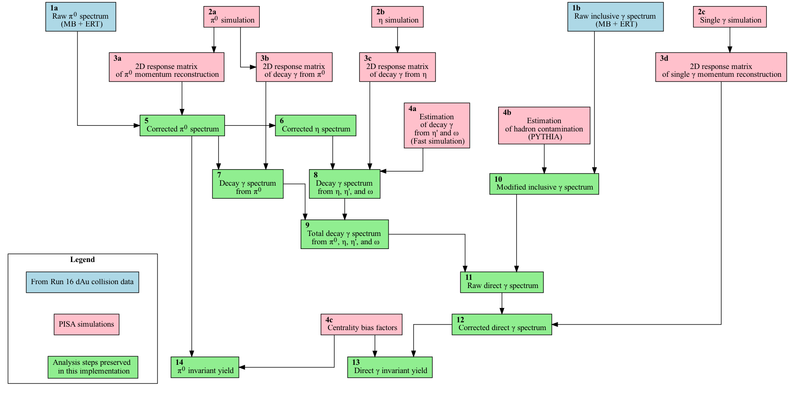

# Direct &#611; in d+Au collisions

The measurement of &gamma; and &pi;<sup>0</sup> yields in d+Au interactions is
important for studying the formation of quark-gluon plasma (QGP) in heavy ion
collisions.

One way to measure QGP formation is by observing jet suppression
using the nuclear modification factor R<sub>AB</sub>, which compares the yield of
a particle (in this case, the &pi;<sup>0</sup>) in AB collisions to that in p+p
collisions. R<sub>AB</sub> is calculated by dividing the invariant yield measured in
AB collisions by N<sub>coll</sub> times the invariant yield measured in p+p
collisions. If R<sub>AB</sub> is equal to one, then the yield observed in AB is the
same as that observed in p+p. If R<sub>AB</sub> is less than one, then the yield in AB
is suppressed, and if it is greater than one, then it is enhanced.

For a more detailed explanation that includes the motivation and physics
background, please refer to this write-up:
[](https://doi.org/10.5281/zenodo.8169171).


* TOC
{:toc}

{{ site.hr }}


## The Analysis Outline

This analysis was performed by Dr. Niveditha Ramasubramanian. The goal of this
page is to consolidate information in a way that is sufficient to make
reproduction of the analysis possible.


### General Analysis Workflow Diagram

<a href="../images/analysis/pi0analysis_general.png">

</a>


### The Source Code

The code prepared for preservation can be found in the `ana-dAuPi0Photon` repository available at
[https://github.com/PhenixCollaboration/ana-dAuPi0Photon](https://github.com/PhenixCollaboration/ana-dAuPi0Photon).

The original location of the analisys code and supplementary files is in
`/gpfs/mnt/gpfs02/phenix/plhf/plhf1/nivram/` accessible from the BNL SDCC's
interactive nodes.


### Input Data

Parts of this analysis use data samples kept in the storage area intended for
long-term preservation. This is its location in the GPFS filesystem of BNL
SDCC:

```shell
/gpfs/mnt/gpfs02/phenix/data_preservation/phnxreco/emcal
```

Additional input files are stored in the [Zenodo repository](https://doi.org/10.5281/zenodo.8117401)
[](https://doi.org/10.5281/zenodo.8117401)


#### Calibration Dependencies

There are "DeadWarn" and "Timing" type of maps which are prerequisite of this
analysis and they are considered as a separate "prior" component. In a condensed
form, they are preserved in the folder
[https://github.com/PhenixCollaboration/ana-dAuPi0Photon/tree/main/sim_Pi0Histogram](https://github.com/PhenixCollaboration/ana-dAuPi0Photon/tree/main/sim_Pi0Histogram)
in the GitHub repository specified above.


### Running the Analysis in Container

In order to run the analysis steps preserved in this implementation, i.e. the
blue and green boxes shown on this
[flowchart](https://phenixcollaboration.github.io/web/images/analysis/pi0analysis_general.png),
one can use either `singularity` or `docker`.


#### Singularity

```
mkdir output_plots
singularity run -B $PWD/output_plots:/dAuPi0Photon/output_plots docker://registry.sdcc.bnl.gov/dap-phenix/dauphotonpi0
```


#### Docker

```
docker run -v $PWD/output_plots:/dAuPi0Photon/output_plots registry.sdcc.bnl.gov/dap-phenix/dauphotonpi0
```


#### Building the Image

If any of the files change in the analysis repository, the following commands
can be used to rebuild the image and push it to the registry:

```
cd ana-dAuPi0Photon
docker build -t registry.sdcc.bnl.gov/dap-phenix/dauphotonpi0 .
docker push registry.sdcc.bnl.gov/dap-phenix/dauphotonpi0
```


### Running the Analysis with REANA

Each step of the analysis can be executed by using the corresponding workflow
defined in the YAML files. For example, to run the code in block `N`, issue the
following command in the terminal:

```shell
reana-client run -f N_reana.yaml -w N_reana
```

The input files will start uploading to the server, and you can check the job
status by pointing your browser to `$REANA_SERVER_URL`. Once the job is
complete, you can use the `reana-client` commands to list the files in the
workspace's working directory on the server and download the output results to
your local machine.

To list the files in the workspace's working directory on the server, use the
following command:

```shell
reana-client ls -w N_reana
```

To download the output results to your local machine, use the following command:

```shell
reana-client download -w N_reana path/to/output/file.dat
```

To select a specific set of files, you can combine the above commands using
Linux piping, for instance:

```shell
reana-client ls -w N_reana | grep output_plots/txt/ | cut -d' ' -f1 | xargs reana-client download -w N_reana
```


### Confirming the Results

One can verify that the output produced is identical to the reference saved in
the repository. The following command should return no differences in the output
files:

```
git clone https://github.com/PhenixCollaboration/ana-dAuPi0Photon.git
cd ana-dAuPi0Photon
diff -r path/to/output_plots/txt output_plots_ref/txt
```


### Analysis Steps

Finally, we provide further details below for each of the analysis steps
referenced by their "block numbers" defined in the analysis workflow diagram.


#### 1a. Raw &pi;<sup>0</sup> spectrum (MB + ERT)

The analysis starts with files produced by the *Taxi* process. The ROOT macro `pi0Extraction.cc` takes the *Taxi* ROOT files as input and generates `MB` (min bias)
and `ERT` (triggered) data as output. This macro is included in a driver script `corrPi0Chain.csh`.

```shell
# condor_Pi0Extraction.cc reformatted and renamed "pi0extraction.C"
root -l -b -q 'pi0extraction.C("MB", "PbSc", 4,5)'
root -l -b -q 'pi0extraction.C("ERT", "PbSc", 4,5)'
root -l -b -q 'WGRatio.C' # Merging MV and ERT spectra of raw pi0 with normalization

# The outputs of this step are placed in the output_plots folder,
# in three subfolders pdf, root, txt
```

These commands are included in ```pi0extraction.yaml```.
Currently a folder ```output_plots``` is created with subfolders ```txt,root,pdf```,
and the folder ```txt``` contains the actual analsys data.

#### 2a. &pi;<sup>0</sup> simulation

Presented below is the core of this workflow which includes processing of
multiple input files (60 in total):

```shell
# the original code found in the Condor submission part:
root -l -b <<EOF
  .L Pi0EmbedFiles.C
   Pi0EmbedFiles t
   t.Loop()
   EOF
```

Adaptation of the _ROOT_ macro for REANA, in a separate file *pi0run.script*:

```shell
gSystem->Load("libTHmul.so");
.L Pi0EmbedFiles.C
Pi0EmbedFiles t
t.Loop()
```

In the REANA script, this is used as follows: ```cat pi0run.script | root -b```.
Note that a PHENIX-specific ROOT library ```libTHmul.so``` is loaded
in the beginning, as this is necessary for proper operation of the macro.

Please refer to the
[relevant folder](https://github.com/PhenixCollaboration/ana-dAuPi0Photon/tree/main/sim_Pi0Histogram)
in the PHENIX GitHub repository for access to the actual material.

This is the driver script ```Pi0EmbedFiles.csh```. Note that symbolic links are created
to feed successive files from a holding folder, to the _ROOT_ macro.

```shell
#!/bin/tcsh
source ./setup_env.csh

foreach i (`seq 0 1 $1`)
    ln -s gpfs/mnt/gpfs02/phenix/data_preservation/phnxreco/emcal/Pi0/test/simPi0_$i.root pi0_dAuMB.root
    echo File: $i
    ls -l pi0_dAuMB.root
    cat pi0run.script | root -b
    mv EmbedPi0dAu.root EmbedPi0dAu_$i.root
    rm pi0_dAuMB.root
end
tar -cf embedPi0dAu.tar EmbedPi0dAu_*
```

Processing of input files takes place sequentially and in this case takes a significant amount
of time compared to other steps, i.e. a feew hours.

The results of all emedding runs are bundled together in a _tar_ archive to make downloading easier. Upon
retrieval the data need to be merged using the utility ```haddPhenix``` which is done in block `3a` (see below).
Upon completion of this step the file ```embedPi0dAu.tar``` needs to be downloaded, and put
in the folder from where the next step is launched. An example of the cownload command, assuming the workflow
was named "embed":

```shell
reana-client download -w embed embedPi0dAu.tar
```

#### 3a. 2D response matrix of &pi;<sup>0</sup> momentum reconstruction

In this step we call a function in ROOT macro ``generationRM_Pi0.C`` that creates a set of ROOT
histograms. The histograms represent the response matrix (RM) for the &pi;<sup>0</sup> meson
production in heavy-ion collisions. The function reads an input ROOT file named ``EmbedPi0dAu.root``
and creates a new output ROOT file named ``Pion_RM.root``. The function calculates the RM by
dividing the Pt response (pTecore vs. generated Pt) for different centrality bins, particle
identification (PID), and detector sectors. The RM is stored in a 2D histogram (TH2D) with Pt bins.
The output response matrix represents the probability for a &pi;<sup>0</sup> particle with a given
generated momentum to be measured with a different momentum due to detector effects.

Tar file containing multiple ROOT files (see previous step `2a`) is uploaded as input for this step.
Abbreviated contents of driver script look as follows:

```shell
#!/bin/tcsh
source ./setup_env.csh
haddPhenix EmbedPi0dAu.root EmbedPi0dAu_*
root -l -b -q 'generationRM_Pi0.C'
```

The macro generates the file ```EmbedPi0dAu.root``` by merging inputs via ```haddPhenix```
and produces ```Pion_RM.root```. The complete description is in ```generationRM_Pi0.yaml```,
which resides with all subsidiary scripts in the folder ```generationRM```.

The workflow description is as follows:

```yaml
version: 0.0.1
inputs:
  files:
    - ./setup_env.csh
    - ./generationRM_Pi0.C
    - ./generationRM_Pi0.csh
    - ./embedPi0dAu.tar
workflow:
  type: serial
  specification:
    steps:
      - environment: 'registry.sdcc.bnl.gov/sdcc-fabric/rhic_sl7_ext:1.3'
        commands:
        - tar xvf embedPi0dAu.tar
        - chmod +x ./generationRM_Pi0.csh
        - ./generationRM_Pi0.csh > output.txt
        - ls -l >> output.txt

outputs:
  files:
    - output.txt
    - Pion_RM.root
```

The result will need to be downloaded as follows (assuming the worflow was assigned the name "gen" in REANA - can be anything):

```shell
reana-client download -w gen Pion_RM.root
```

#### 5. Corrected &pi;<sup>0</sup> spectrum

This REANA step (final in this analysis)
is accomplished with scripts and macros named ```VConvolution_Pi0*```. The file ```Pion_RM.root```
serves as input, along with text files residing in ```output_plots``` previosly produced by the macros
```pi0extraction.C``` and ```WGRatio.C```:

```shell
scaledUEB_rawPi0_ERT_PbSc_0CC88_Chi2_3Sig.txt
scaledUEB_rawPi0_MB_PbSc_0CC88_Chi2_3Sig.txt
scaledUEB_rawPi0_BBCpERT_PbSc_0CC88_Chi2_3Sig.txt
````

The core of this step looks like this:

```shell
root -l -b -q 'VConvolution_Pi0.C'
```

The REANA submission file has this content:

```yaml
version: 0.0.1
inputs:
  directories:
    - ./output_plots
  files:
    - ./inputTrialFunction_Pi0.txt
    - ./setup_env.csh
    - ./VConvolution_Pi0.C
    - ./VConvolution_Pi0.csh
    - ./Pion_RM.root
workflow:
  type: serial
  specification:
    steps:
      - environment: 'registry.sdcc.bnl.gov/sdcc-fabric/rhic_sl7_ext:1.3'
        commands:
        - chmod +x ./VConvolution_Pi0.csh
        - ls -l > output.txt
        - ./VConvolution_Pi0.csh >> output.txt
        - ls -l >> output.txt

outputs:
  files:
    - output.txt0
```

Outputs are also written in ```output_plots/txt``` and contain
```shell
scaledEB_corrPi0_BBCpERT_PbSc_0CC88_Chi2_3Sig.txt
scaledUEB_corrPi0_BBCpERT_PbSc_0CC88_Chi2_3Sig.txt
```


#### 6. Corrected &eta; spectrum

This step is implemented using two functions `getEtaSpectrum` and
`getEtaSpectrum_UEB` that process data from the input files and applies
correction factors to obtain the spectrum of eta particles in different
centrality bins.

**Inputs:**

```shell
scaledEB_corrPi0_BBCpERT_
scaledUEB_corrPi0_BBCpERT_
```

**Outputs:**

```shell
scaledEB_corrEta_BBCpERT_
scaledUEB_corrEta_BBCpERT_
```


#### 7. Decay &gamma; spectrum from &pi;<sup>0</sup>

In this, we take the corrected pion spectrum from the convoulution procedure and
then multiply it by the gamma response matrix and obtain the decay gamma
spectrum for pions. See `VconvolutionRMgamma_Pi0`.

**Inputs:**

```shell
scaledEB_corrPi0_BBCpERT_
scaledUEB_corrPi0_BBCpERT_
rawDG_Pion.root
```

**Outputs:**

```shell
scaledUEB_rawDGPi0_BBCpERT_
```


#### 8. Decay &gamma; spectrum from &eta;, &eta;', and &Omega;

In this we take the corrected pion spectrum from the convoulution procedure and
then multiply it by the gamma response matrix and obtain the decay gamma
spectrum for pions. See `VconvolutionRMgamma_Eta`.

**Inputs:**

```shell
rawDG_Eta.root
scaledEB_corrEta_BBCpERT_
scaledUEB_corrEta_BBCpERT_
```

**Outputs:**

```shell
scaledUEB_rawDGEta_BBCpERT_
withTimingDM_1p4Sig_VconRMgamma.root
```


#### 9. Total decay &gamma; spectrum from &pi;<sup>0</sup>, &eta;, &eta;', and &Omega;

`rawDG_EPP`

**Inputs:**

```shell
scaledUEB_rawDGEta_BBCpERT_
scaledUEB_rawDGPi0_BBCpERT_
```

**Outputs:**

```shell
scaledUEB_rawDGEPP_BBCpERT_
```


#### 10. Modified inclusive &gamma; spectrum

`getNewSpectrum`

**Inputs:**

```shell
landauEval.txt
scaledUEB_rawIP_BBCpERT_
```

**Outputs:**

```shell
scaledUEB_newrawIP_BBCpERT_
```


#### 11. Raw direct &gamma; spectrum

`rawDP`

**Inputs:**

```shell
scaledUEB_rawDGEPP_BBCpERT_
scaledUEB_newrawIP_BBCpERT_
```

**Outputs:**

```shell
scaledUEB_rawDP_BBCpERT_
```


#### 12. Corrected direct &gamma; spectrum

`VconvolutionRM_Photon`

**Inputs:**

```shell
AN1371_spectrumPoints.txt
Photon_RM.root
scaledUEB_rawDP_BBCpERT_
```

**Outputs:**

```shell
scaledEB_corrDP_BBCpERT_
scaledUEB_corrDP_BBCpERT_
```


#### 13. Direct &gamma; invariant yield

`Centrality_corrDP_highPt`

**Inputs:**

```shell
statErr_corrDP_BBCpERT_
```

**Outputs:**

```shell
invyield_corrDP_BBCpERT_
```


#### 14. &pi;<sup>0</sup> invariant yield

`Centrality_corrPi0_highPt`

**Inputs:**

```shell
statErr_corrPi0_BBCpERT_
```

**Outputs:**

```shell
invyield_corrPi0_BBCpERT_
```
